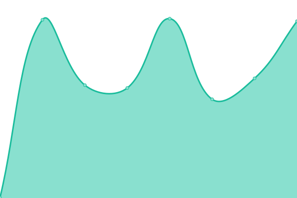
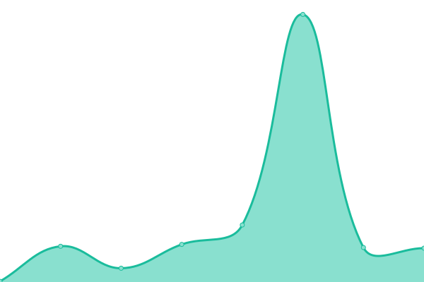

# [📈 Live Status](https://status.forcemanager.com): <!--live status--> **🟩 All systems operational**

<!--start: status pages-->
<!-- This summary is generated by Upptime (https://github.com/upptime/upptime) -->
<!-- Do not edit this manually, your changes will be overwritten -->
<!-- prettier-ignore -->
| URL | Status | History | Response Time | Uptime |
| --- | ------ | ------- | ------------- | ------ |
|  API | 🟩 Up | [api.yml](https://github.com/ForceManager/status/commits/HEAD/history/api.yml) | 

 523ms
     
 | 

<a href="https://status.forcemanager.com/history/api">100.00%</a>
    

|  APP | 🟩 Up | [app.yml](https://github.com/ForceManager/status/commits/HEAD/history/app.yml) | 

 99ms
     
 | 

<a href="https://status.forcemanager.com/history/app">100.00%</a>
    

|  BACKEND | 🟩 Up | [backend.yml](https://github.com/ForceManager/status/commits/HEAD/history/backend.yml) | 

 654ms
     
 | 

<a href="https://status.forcemanager.com/history/backend">100.00%</a>
    

<!--end: status pages-->

[**Visit our status website →**](https://status.forcemanager.com)

## 📄 License

- Powered by: [Upptime](https://github.com/upptime/upptime)
- Code: [MIT](./LICENSE) © [ForceManager](https://www.forcemanager.com/)
- Data in the `./history` directory: [Open Database License](https://opendatacommons.org/licenses/odbl/1-0/)
